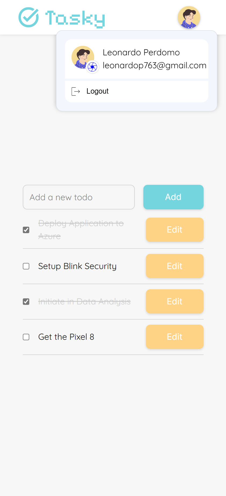

<!-- Please update value in the {}  -->

<h1 align="center">Todo Web App</h1>


<div align="center">
  <h3>
    <a href="https://todo-webapp-2023.netlify.app">
      Demo
    </a>
    <span> | </span>
    <a href="https://github.com/leonardoapd/todo-web-app">
      Github Repository
    </a>
  </h3>
</div>

<!-- TABLE OF CONTENTS -->

## Table of Contents

- [Table of Contents](#table-of-contents)
- [Overview](#overview)
  - [Built With](#built-with)
- [Features](#features)
- [How To Use](#how-to-use)
- [Contact](#contact)

<!-- OVERVIEW -->

## Overview




Project Description:

A robust web application project showcasing my proficiency in React and Vite, focused on a To-Do application. The project incorporates essential features such as login and signup forms, authentication interceptors, and custom hooks. By leveraging React's capabilities and Vite's efficiency, the application delivers a seamless user experience while demonstrating my skills in modern web development.

Demo: You can see the live demo of the Todo List by visiting this link: [Todo List Demo](https://todo-webapp-2023.netlify.app/)

Experience: During the development of this project, I gained valuable experience in building Single-Page Applications (SPAs) using React. Through implementing HTTP requests with axios to the backend, I enhanced my understanding of frontend-backend communication and real-time data manipulation. 

Additionally, I acquired skills in implementing custom hooks to reuse logic and facilitate component development, resulting in improved development efficiency. 

Moreover, I utilized a router to manage application navigation and ensure a seamless user experience. 

Furthermore, I implemented interceptors to enhance security and protect sensitive data, thereby improving the overall integrity of the application. 

These accomplishments significantly contributed to my growth as a developer and strengthened my skill set in full-stack web development.

### Built With

<!-- This section should list any major frameworks that you built your project using. Here are a few examples.-->

- [Vite](https://vitejs.dev/)
- [React](https://reactjs.org/)
- [Axios](https://axios-http.com/)
- [React Router](https://reactrouter.com/)

## Features

<!-- List the features of your application or follow the template. Don't share the figma file here :) -->

- Login and Signup forms
- Authentication interceptors
- Responsive design
- HTTP requests with axios
- Form validation
  
## How To Use

<!-- Example: -->

To clone and run this application, you'll need [Git](https://git-scm.com) and [Node.js](https://nodejs.org/en/download/) (which comes with [npm](http://npmjs.com)) installed on your computer. From your command line:

```bash
# Clone this repository
$ git clone https://github.com/leonardoapd/todo-web-app.git

# Install dependencies
$ npm install

# Run the app
$ npm run dev
```

For the backend side, you will need .NET 7.0 installed on your computer. You can download it here: [Download .NET 7.0](https://dotnet.microsoft.com/download/dotnet/7.0). Once you have .NET 7.0 installed, you can clone the repository and run the following commands:

```bash
# Clone this repository
$ git clone https://github.com/leonardoapd/todo-web-api.git

# Run the backend API
$ dotnet watch run
```

You will also need to create a .env file in the root directory of the project and add the following environment variables:

```bash
# Vite Config .env file
VITE_API_URL=your_api_url
```


<!-- This section should list any articles or add-ons/plugins that helps you to complete the project. This is optional but it will help you in the future. For example -->


## Contact

- Website [leonardo-perdomo.netlify.app](https://leonardo-perdomo.netlify.app)
- GitHub [@leonardoapd](https://github.com/leonardoapd)
- Twitter [@leonardoapd](https://twitter.com/leonardoapd)
